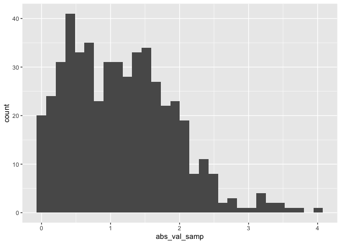

Simple document
================
Lindsey Abramson
2025-09-11

I’m an R Markdown document!

``` r
library(tidyverse)
```

    ## ── Attaching core tidyverse packages ──────────────────────── tidyverse 2.0.0 ──
    ## ✔ dplyr     1.1.4     ✔ readr     2.1.5
    ## ✔ forcats   1.0.0     ✔ stringr   1.5.1
    ## ✔ ggplot2   3.5.2     ✔ tibble    3.3.0
    ## ✔ lubridate 1.9.4     ✔ tidyr     1.3.1
    ## ✔ purrr     1.1.0     
    ## ── Conflicts ────────────────────────────────────────── tidyverse_conflicts() ──
    ## ✖ dplyr::filter() masks stats::filter()
    ## ✖ dplyr::lag()    masks stats::lag()
    ## ℹ Use the conflicted package (<http://conflicted.r-lib.org/>) to force all conflicts to become errors

# Section 1

Here’s a **code chunk** that samples from a *normal distribution*:

``` r
samp = rnorm(100)
length(samp)
```

    ## [1] 100

# Section 2

I can take the mean of the sample, too! The mean is 0.0152849.

# Section 3

This is where I’m going to talk about code chunks.

``` r
mean(samp)
sd(samp)
```

Let’s make a plor and see how cool that is!

``` r
plot_df = tibble(
  x=rnorm(1000, mean=1, sd=.5),
  y=1+2*x

)
```

# Learning assessment

This chunk does one of the LA

``` r
la_df = 
  tibble(
    numeric_samp = rnorm(500, mean=1),
    abs_val_samp = abs(numeric_samp)
  )

ggplot(la_df, aes(x=abs_val_samp)) + geom_histogram()
```

    ## `stat_bin()` using `bins = 30`. Pick better value with `binwidth`.

<!-- -->
To use inline code, I would do something like: “The sample size in the
new dataframe is 500”

Something mroe complex is “The mean of my new variable is 1.154625 \`

## Text formatting

*italic* or *italic* **bold** or **bold** `code` superscript<sup>2</sup>
and subscript<sub>2</sub>

## Headings

# 1st Level Header

## 2nd Level Header

### 3rd Level Header

## Lists

- Bulleted list item 1

- Item 2

  - Item 2a

  - Item 2b

1.  Numbered list item 1

2.  Item 2. The numbers are incremented automatically in the output.

## Tables

| First Header | Second Header |
|--------------|---------------|
| Content Cell | Content Cell  |
| Content Cell | Content Cell  |
